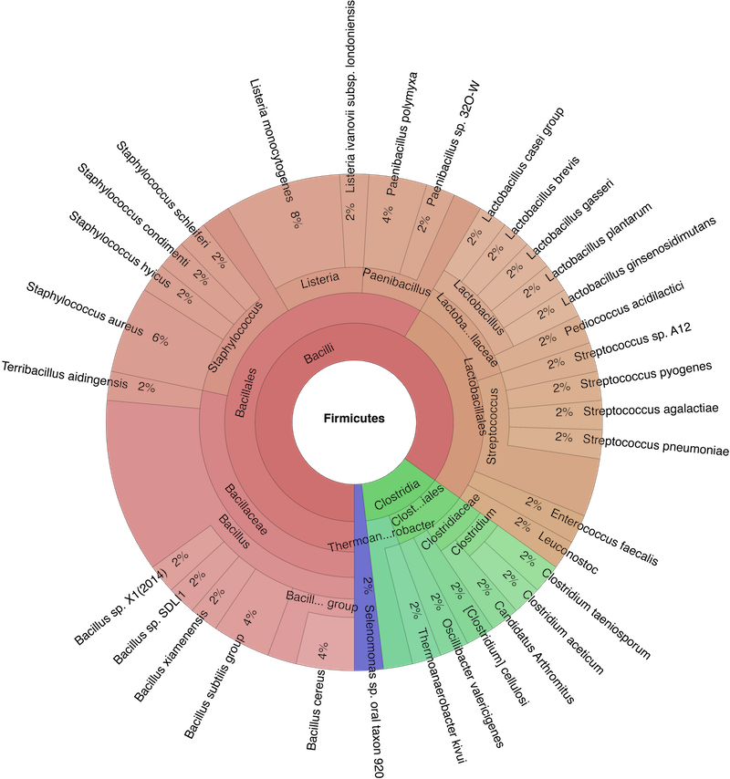

.. _taxonomic-investigation:

NGS - Taxonomic investigation
=============================

Overview
--------

We want to investigate if there are sequences of other species in our collection of sequenced DNA pieces.
We know most of them are from our species that we try to assemble.
However, lets investigate if we have possibly sequences from other species sequenced maybe they got into the sample through contamination.
We could also decide in section :ref:`ngs-mapping` to classify all unmapped sequence reads with |kraken|.

We will use the tool |kraken| to assign taxonomic classifications to our sequence reads.
Let us see if we can id some sequences from other fungi or even bacteria.

Kraken
------

We will be using a tool called |kraken| [WOOD2014]_.
This tool uses k-mers to assign a taxonomic labels in form of |ncbitax| to the sequence (if possible).
The taxonomic label is assigned based on similar k-mer content of the sequence in question to the k-mer content of reference genome sequence.
The result is a classification of the sequence in question to the most likely taxonomic label.
If the k-mer content is not similar to any genomic sequence in the database used, it will not assign any taxonomic label.

Installation
------------

Use conda in the same fashion as before to install |kraken|:

.. code:: bash
          
   source activate ngs
   conda install kraken-all

   
Now we need to create or download a |kraken| database that can be used to assign the taxonomic labels to sequences.
We opt for downloading a pre-build database from the |kraken| website:

.. code:: bash
          
   curl -O https://ccb.jhu.edu/software/kraken/dl/minikraken.tgz

   # alternatively we can use wget
   wget https://ccb.jhu.edu/software/kraken/dl/minikraken.tgz
   
   # once the download is finished, we need to extract the archive content
   # it will create a directory: "minikraken_20141208/"
   tar -xvzf minikraken.tgz

.. ATTENTION::
   Should the download fail. Please find links to alternative locations on the
   :ref:`downloads` page.
   
   
   
Usage
-----

Now that we have installed |kraken| and downloaded and extracted the minikraken database, we can attempt to investigate the sequences we got back from the sequencing provider for other species as the one it should contain.
We call the |kraken| tool and specify the database and fasta-file with the sequences it should use. 

.. rst-class:: sebcode
   
   kraken --db minikraken_20141208 |filebase|.fa > |filebase|.kraken

   
This may take a few minutes, depending on how many sequences we are going to classify.
The resulting content of the file |filebase|.kraken looks similar to the following example:

.. include:: example-kraken.txt
   :literal:
   :end-line: 5

Each sequence classified by |kraken| results in a single line of output.
Output lines contain five tab-delimited fields; from left to right, they are:

1. ``C/U``: one letter code indicating that the sequence was either classified or unclassified.
2. The sequence ID, obtained from the FASTA/FASTQ header.
3. The taxonomy ID Kraken used to label the sequence; this is **0** if the sequence
   is unclassified and otherwise should be the |ncbitax| identifier.
4. The length of the sequence in bp.
5. A space-delimited list indicating the lowest common ancestor (in the
   taxonomic tree) mapping of each k-mer in the sequence.
   For example, ``562:13 561:4 A:31 0:1 562:3`` would indicate that:
   
   * the first 13 k-mers mapped to taxonomy ID #562
   * the next 4 k-mers mapped to taxonomy ID #561
   * the next 31 k-mers contained an ambiguous nucleotide
   * the next k-mer was not in the database
   * the last 3 k-mers mapped to taxonomy ID #562

.. NOTE::
   The |kraken| manual can be accessed `here <http://ccb.jhu.edu/software/kraken/MANUAL.html>`__.

Investigate taxa
----------------

We can use the webpage `NCBI TaxIdentifier <https://www.ncbi.nlm.nih.gov/Taxonomy/TaxIdentifier/tax_identifier.cgi>`__ to quickly get the names to the taxonomy identifier.
However, this is impractical as we are dealing potentially with many sequences.
|kraken| has some scripts that help us understand our results better.

kraken-report
^^^^^^^^^^^^^

First, we generate a sample-wide report of all taxa found.
This can be achieved with the tool ``kranken-report``.

.. rst-class:: sebcode 

   kraken-report --db minikraken_20141208 |filebase|.kraken | gzip > |filebase|.kraken.report.gz

The first few lines of thus a report are shown below.
   
.. include:: example-kraken-report.txt 
   :literal: 

The output of kraken-report is tab-delimited, with one line per taxon.
The fields of the output, from left-to-right, are as follows:

1. **Percentage** of reads covered by the clade rooted at this taxon
2. **Number of reads** covered by the clade rooted at this taxon
3. **Number of reads** assigned directly to this taxon
4. A rank code, indicating **(U)nclassified, (D)omain, (K)ingdom, (P)hylum, (C)lass, (O)rder, (F)amily, (G)enus, or (S)pecies**. All other ranks are simply **"-"**.
5. |ncbitax| ID
6. indented scientific name
            
To be able to compare the taxa content of one sample to another, we can create a report whose structure is always the same, disregarding which taxa are found (obviously the percentages and numbers will be different) for all samples.
We will print out all taxa (instead of only those found), ``--show-zeros`` option and sort them according to taxa-ids (column 5), e.g. ``sort -n -k5``.

.. rst-class:: sebcode 

   kraken-report *--show-zeros* --db minikraken_20141208 |filebase|.kraken | **sort -n -k5** | gzip > |filebase|.kraken.report.sorted.gz

The report is not ordered according to taxa ids and contains all taxa in the database, even if they have not been found in our sample and are thus zero (e.g. "Methylophilus methylotrophus" in the example below):
   
.. include:: example-kraken-report2.txt 
   :literal: 

The columns are the same as in the former report, however, we have more rows and they are now differently sorted, according to the |ncbitax| id.

kraken-translate
^^^^^^^^^^^^^^^^
   
For every sequence in our sample and its predicted taxonomic identifier,
we can attach the taxonomic names with ``kraken-translate``.

.. rst-class:: sebcode 

   kraken-translate --mpa-format --db --db minikraken_20141208 |filebase|.kraken | gzip > |filebase|.kraken.names.gz

.. include:: example-kraken-translate.txt 
   :literal: 

Here, each sequence that got classified is present in one row.
The nomenclature for the names is preceded with an letter according to its rank, e.g. **(d)omain, (k)ingdom, (p)hylum, (c)lass, (o)rder, (f)amily (g)enus, or (s)pecies**.
Taxonomy assignments above the superkingdom (**d**) rank are represented as just **root**. 

Visualisation
^^^^^^^^^^^^^

We use the |krona| tools to create a nice interactive visualisation of the taxa content of our sample [ONDOV2011]_.
Install |krona| with:

.. code:: bash

   source activate ngs
   conda install krona

First some house-keeping to make the |krona| installation work.
Do not worry to much about what is happening here.

.. code:: bash

   # we delete a symbolic link that is not correct
   rm -rf ~/miniconda3/envs/ngs/opt/krona/taxonomy

   # we create a directory in our home where the krona database will live
   mkdir -p ~/krona/taxonomy

   # now we make a symbolic link to that directory 
   ln -s ~/krona/taxonomy ~/miniconda3/envs/ngs/opt/krona/taxonomy
   
   # now we copy some scripts around, this is neccaesayry as krona installation fails to do this
   cp -r ~/miniconda3/envs/ngs/opt/krona/scripts ~/miniconda3/envs/py3-kraken/bin/

We need to build a taxonomy database for |krona|.
However, if this fails we will skip this step and just download a pre-build one.
Lets first try to build one.

.. code:: bash
          
   ktUpdateTaxonomy.sh ~/krona/taxonomy

Now, if this fails, we download a pre-build taxonomy database for krona.
   
.. code:: bash
          
   # Download pre-build database
   curl -O http://compbio.massey.ac.nz/data/taxonomy.tab.gz
   gzip -d taxonomy.tab.gz
   mv taxonomy.tab ~/krona/taxonomy
   
.. ATTENTION:: 
   Should this also fail we can download a pre-build database on the :ref:`downloads` page via a browser.

Now we use the tool ``ktImportTaxonomy`` from the |krona| tools to crate the html web-page:

.. rst-class:: sebcode 

   cat |filebase|.kraken | cut -f 2,3 > |filebase|.kraken.krona
   ktImportTaxonomy |filebase|.kraken.krona
   firefox taxonomy*.html

What happens here is that we extract the second and third column from the |kraken| results.
We input these to the |krona| script, and open the resulting web-page in a bowser. An example (albeit an extrem one) of the output html-file can be found `here <../_static/taxonomy.krona.html>`_.

.. _fig-krona:

   Example of an Krona output webpage.
